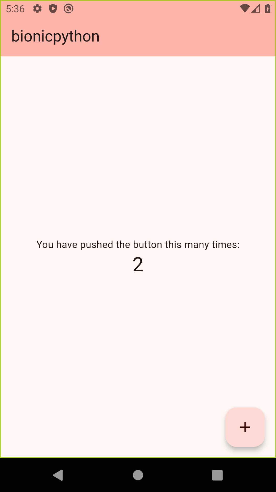

# BionicPython 🚀✨

Transform your PDFs and DOCX files into an eye-catching, easy-to-read **Bionic Reading** format in no time! 💥

## Why BionicPython? 🤔
- Boost reading speed and comprehension.
- Enjoy a visually stimulating reading experience.
- Simplify conversion with a single command.

## Before & After 📸
### Normal Format

### Bionic Format


## Quick Start 🚦
1. **Clone this repository**  
   `git clone https://github.com/username/bionicpython.git`
2. **Install requirements**  
   ```bash
   pip install -r requirements.txt
   ```
3. **Convert your PDF/DOCX**  
   ```bash
   python bionicpython/bionicpython.py <path to your pdf/docx file>
   ```
4. **Enjoy your new bionified file**  
   A new DOCX is created in the same directory (convert to PDF if you want).

> **Note**: If you're on macOS or Linux, try `setup.sh`. On Windows, run `setup.ps1`. Both aim to simplify setup.  

## Roadmap 🛣️
- [X] Provide usage guide
- [ ] Create a pip package
- [ ] Add other ebook formats like EPUB
- [ ] Optimize performance
- [ ] Build a GUI (we’re on it!)

## Keeping You Posted 📰
We're actively improving and appreciate your suggestions and contributions.  
Feel free to open an **issue** or **pull request** anytime!  

